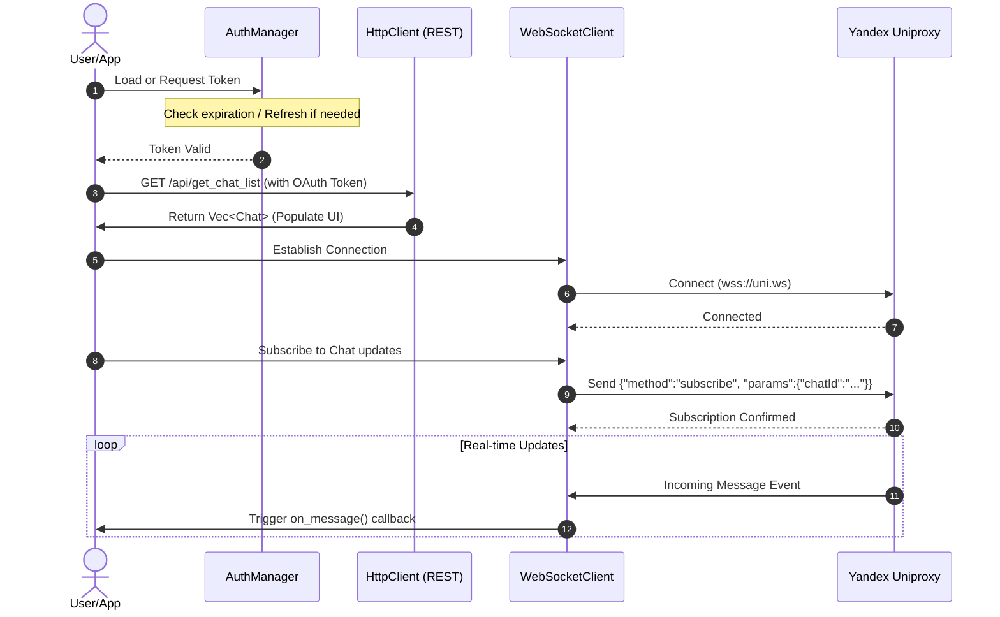
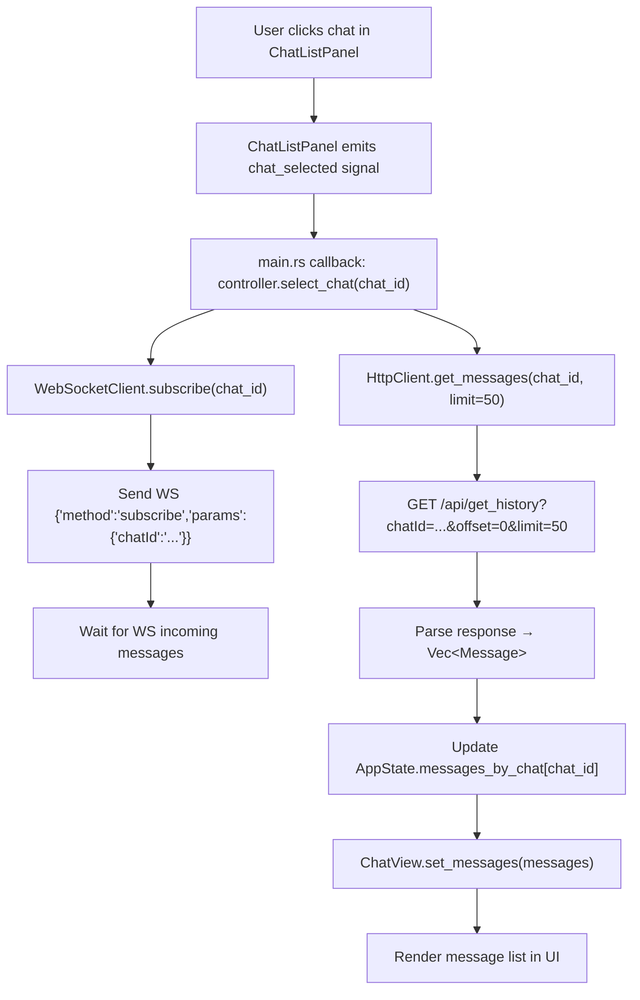
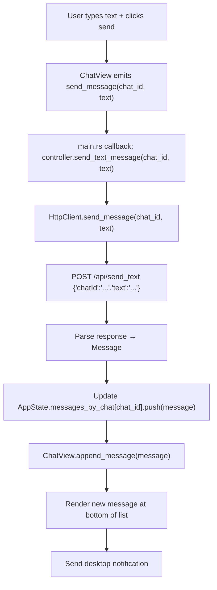
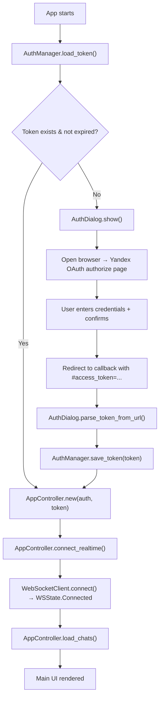
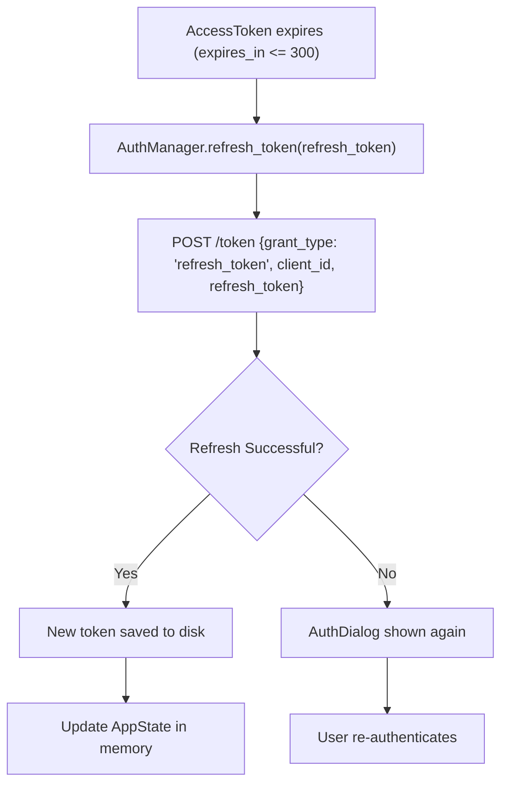
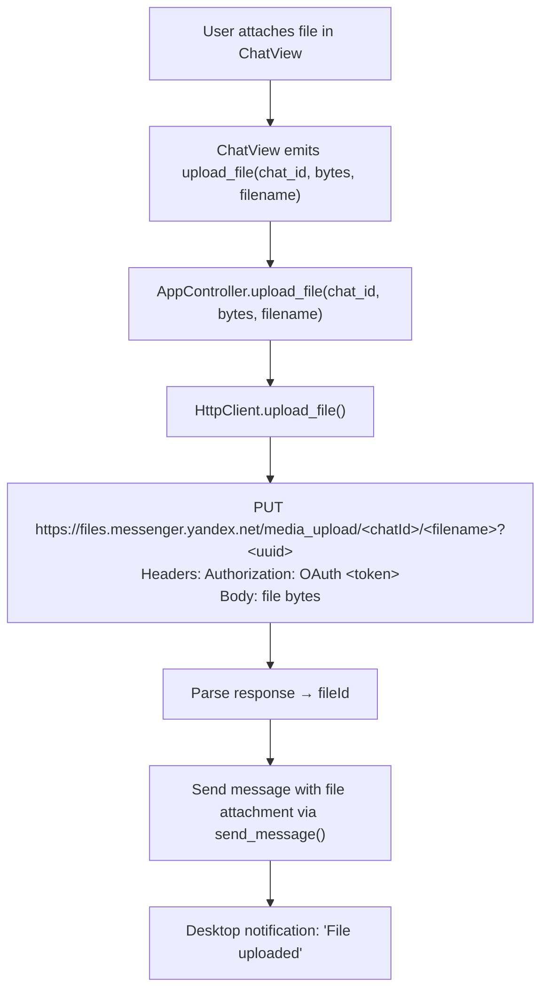
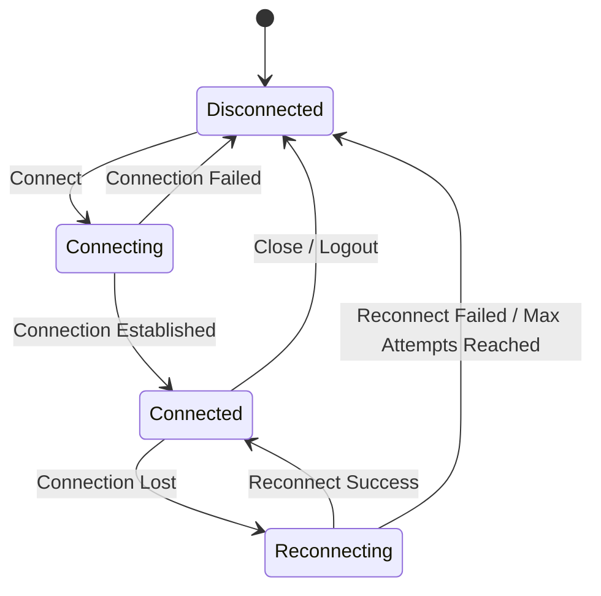

# Yandex Messenger Native — Architecture

[Русская версия](ARCHITECTURE.ru.md)

Current release: **2.173.0**.

## Overview

Native Linux desktop client for Yandex Messenger built with Rust and GTK4.
The application follows a layered architecture with clear separation between UI,
business logic, and API communication.

```mermaid
flowchart TD
    %% Styling
    classDef user fill:#e1f5fe,stroke:#01579b,stroke-width:2px;
    classDef ui fill:#e8f5e9,stroke:#2e7d32,stroke-width:2px;
    classDef core fill:#fff8e1,stroke:#f57f17,stroke-width:2px;
    classDef api fill:#f3e5f5,stroke:#6a1b9a,stroke-width:2px;
    classDef ext fill:#ffebee,stroke:#c62828,stroke-width:2px;

    subgraph UserGroup ["User Space"]
        User["User (Desktop)"]:::user
    end

    subgraph UILayer ["UI Layer (src/ui/*)"]
        direction LR
        AuthDialog["AuthDialog"]
        ChatListPanel["ChatListPanel"]
        ChatView["ChatView"]
        TelemostWindow["TelemostWindow"]
        TrayHandle["TrayHandle"]
        Notifications["Notifications"]
        Settings["Settings"]
        Theme["Theme (CSS)"]
    end
    class UILayer ui;

    subgraph CoreLayer ["Core Layer (src/core.rs)"]
        AppController["AppController"]
        AppState["AppState (Arc&lt;Mutex&gt;)"]
        AppEvent["AppEvent (enum)"]
    end
    class CoreLayer core;

    subgraph APILayer ["API Layer (src/api/*)"]
        direction LR
        AuthManager["AuthManager (OAuth2)"]
        HttpClient["HttpClient (reqwest)"]
        WebSocketClient["WebSocketClient"]
    end
    class APILayer api;

    subgraph External ["External Services"]
        OAuth["OAuth Endpoints"]
        MessengerAPI["Messenger API (REST)"]
        UniproxyWS["Uniproxy WS"]
        Disk["Files (Yandex Files)"]
    end
    class External ext;

    %% Connections
    User -->|"GTK4 Events / System Calls"| UILayer
    UILayer -->|"Callbacks / Shared State"| CoreLayer
    CoreLayer -->|"Async API Calls"| APILayer
    APILayer -->|"HTTP / WS / Disk"| External
```



## Layer Descriptions

### UI Layer

The UI layer consists of GTK4 standalone widgets, each managing its own rendering
and user interaction. Widgets communicate with the core through callback closures
and shared state references.

- **AuthDialog** (`auth_dialog.rs`): OAuth login dialog. Supports external browser
  flow and in-app WebView (feature `in_app_webview`). Parses token from URL fragment.
- **ChatListPanel** (`chat_list.rs`): Sidebar displaying chats with title, avatar,
  last message preview, unread count, and pin/archive indicators. Emits `chat_selected`
  signal.
- **ChatView** (`chat_view.rs`): Main message area with MessageList (virtualized),
  MessageInput (text + attachments), and call button. Handles send, reply, forward,
  and reactions display.
- **TelemostWindow** (`telemost.rs`): Window wrapper for Yandex Telemost video calls.
  Supports mute, video toggle, and end call controls.
- **TrayHandle** (`tray.rs`): System tray icon with menu (open, settings, quit).
- **Notifications** (`notifications.rs`): Desktop notifications via `notify-rust`.
- **Settings** (`settings.rs`): JSON-based persistent settings (dark theme, minimize
  to tray, notifications, reduce animations). Stored in `~/.config/yandex-messenger-native/settings.json`.
- **Theme** (`theme.css`): Telegram Desktop night tokens, nheko-style dense list,
  `msgIn` / `msgOut` bubbles, adaptive sidebar.

### Core Layer

`AppController` (`src/core.rs`) is the central orchestrator. It owns:

- `AuthManager` — OAuth token lifecycle
- `HttpClient` — REST API communication (session cookies + CSRF)
- `WebSocketClient` — Real-time communication
- `AppState` — Shared mutable application state
- SQLite cache (`src/core/db.rs`), drafts (`drafts.rs`), outbox (`outbox.rs`)
- Session store (`src/api/session_store.rs`) — Passport cookies written on WebView login

`AppState` holds:
```rust
pub struct AppState {
    pub chats: Vec<Chat>,                    // Cached chat list
    pub selected_chat_id: Option<String>,    // Currently active chat
    pub messages_by_chat: HashMap<String, Vec<Message>>, // Message history per chat
}
```

The controller exposes async methods for all operations. UI code calls these via
`tokio::Runtime::block_on()` in the GTK main context.

### API Layer

#### AuthManager (`src/api/auth.rs`)

Handles the complete OAuth2 Authorization Code Flow:

1. Generates auth URL with `response_type=code`, `client_id`, `state`, `device_id`
2. User authenticates in browser, redirected with `#access_token=...`
3. Token parsed from URL fragment and saved to `~/.config/yandex-messenger-native/token.json`
4. On startup, loads token from disk; checks expiry (300s buffer)
5. If expired, uses `refresh_token` to obtain new access_token
6. Supports auth-proxy mode for centralized OAuth

Token storage uses file locking (via `fs::write`) and stores JSON with:
- `access_token`, `refresh_token`, `expires_in`, `token_type`, `user_id`

#### HttpClient (`src/api/mod.rs`)

REST client built on `reqwest` with `rustls-tls`:

- **Authentication**: `OAuth <token>` header on all requests
- **CSRF**: Fetches CSRF token from `/csrf-token/` before mutations
- **Chat list**: `GET /api/get_chat_list?offset=&limit=`
- **History**: `GET /api/get_history?chatId=&offset=&limit=`
- **Send message**: `POST /api/send_text` with JSON body
- **Upload**: `PUT /media_upload/<chatId>/<filename>?<uuid>` to Yandex Files
- **Download**: `GET /file_shortterm/<fileId>` from Yandex Files
- **User profile**: `GET /api/get_profile`
- **Telemost URL**: Generates `https://telemost.yandex.ru/?chatId=<id>`

Response parsing handles both flat arrays and wrapped responses (`ListResponse<T>`
with `items`/`chats`/`messages` fields).

#### WebSocketClient (`src/api/mod.rs`)

WebSocket client for Yandex Uniproxy (`wss://uniproxy.messenger.yandex.ru/uni.ws`):

- **Sequence counter**: Each message gets a monotonically increasing `seq`
- **Message format**: `{"seq": N, "message": {"method": "...", "params": {...}}}`
- **Methods**: `subscribe`, `unsubscribe`, `bootstrap`
- **Callbacks**: `on_message()` for incoming WS messages, `on_state_change()` for
  connection state events (Disconnected → Connecting → Connected → Reconnecting)
- **Current state**: Stub connect/send (full transport loop pending)

### Models (`src/models/mod.rs`)

Domain types with `serde` serialization:

- **Chat**: id, title, type (Private/Group/Channel/Bot), participants, unread count,
  last message, pinned/archived/muted flags
- **Message**: id, chat_id, from_id, type, text, entities, reply_to, forward, media,
  reactions, read/delivered/sent status, edit tracking
- **User**: id, phone, email, display_name, username, avatar_id, status, bot/premium flags
- **WSMessage/WSResponse**: WebSocket protocol envelope with seq, result, error
- **MediaAttachment**: file metadata with thumbnail, dimensions, size, duration
- **TelemostCall**: call lifecycle with participants and status

## Data Flow Diagrams

### WebSocket/HTTP Interaction Flow



### Chat Selection Flow



### Message Send Flow



### OAuth Flow



### Token Refresh Flow



### File Upload Flow



## State Management

The application uses a single shared state pattern:

```
AppController (owns)
    └── Arc<Mutex<AppState>>
            ├── chats: Vec<Chat>
            ├── selected_chat_id: Option<String>
            └── messages_by_chat: HashMap<String, Vec<Message>>
```

UI components receive `Arc<Mutex<AppState>>` clones and lock for reads.
Mutations happen in `AppController` async methods, then UI is updated via
callback closures defined in `main.rs`.

This approach avoids complex state management libraries while providing
thread-safe access through Tokio's `Mutex`.

## WebSocket Protocol

The WebSocket client communicates with Yandex Uniproxy using a sequence-based
protocol:

### Outgoing Message Format
```json
{
  "seq": 0,
  "message": {
    "method": "subscribe",
    "params": {"chatId": "chat-uuid"}
  }
}
```

### Supported Methods
- `subscribe` — Start receiving messages for a chat
- `unsubscribe` — Stop receiving messages for a chat
- `bootstrap` — Request initial state (flags: with_deleted, compact)

### Incoming Message Format
```json
{
  "seq": 0,
  "result": {...},
  "error": null
}
```

Or for event notifications:
```json
{
  "seq": 1,
  "message": {
    "method": "message",
    "params": {"chatId": "...", "message": {...}}
  }
}
```

### Connection States



Max reconnect attempts: 10 (from config `WS_MAX_RECONNECT_ATTEMPTS`).

## Configuration Constants (`src/config.rs`)

| Constant | Value | Purpose |
|---|---|---|
| `OAUTH_CLIENT_ID` | `<YOUR_YANDEX_CLIENT_ID>` | Yandex OAuth client ID |
| `API_BASE_URL` | `https://yandex.ru/messenger/api/registry/api/` | REST API base |
| `UNIPROXY_URL` | `wss://uniproxy.messenger.yandex.ru/uni.ws` | WebSocket endpoint |
| `FILE_PUBLIC_HOST` | `https://files.messenger.yandex.net` | File upload/download |
| `TELEMOST_URL` | `https://telemost.yandex.ru` | Video calls |
| `MAX_MESSAGE_LENGTH` | 4096 | Max message text length |
| `MAX_FILE_SIZE` | 50MB | Max file upload size |
| `HISTORY_CHUNK_SIZE` | 50 | Messages per history page |
| `WS_HEARTBEAT_INTERVAL` | 30s | WebSocket heartbeat |
| `MAX_MEMBERS_COUNT` | 1000 | Group member limit |

## Component Interaction Summary

| Component | Depends On | Provides To |
|---|---|---|
| `main.rs` | All layers | Entry point, wiring |
| `AppController` | AuthManager, HttpClient, WebSocketClient | AppState, API methods |
| `ChatListPanel` | AppController (via callbacks) | chat_selected signal |
| `ChatView` | AppController (via callbacks) | send_message, upload_file, start_call |
| `AuthDialog` | AuthManager | OAuth token |
| `WebSocketClient` | AuthManager | WS send/subscribe/callbacks |
| `HttpClient` | None (uses reqwest) | REST API methods |
| `SettingsStore` | filesystem (dirs crate) | Settings struct |
