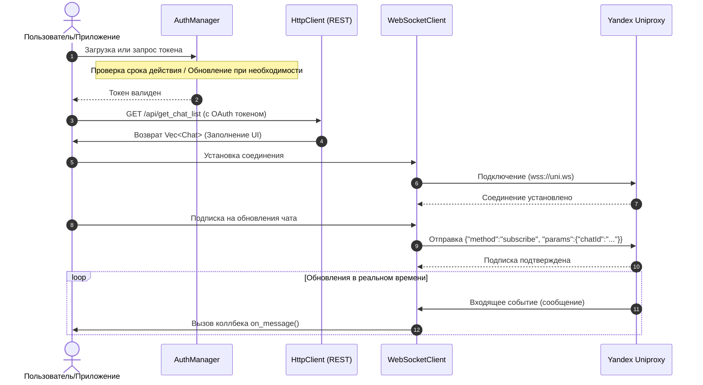
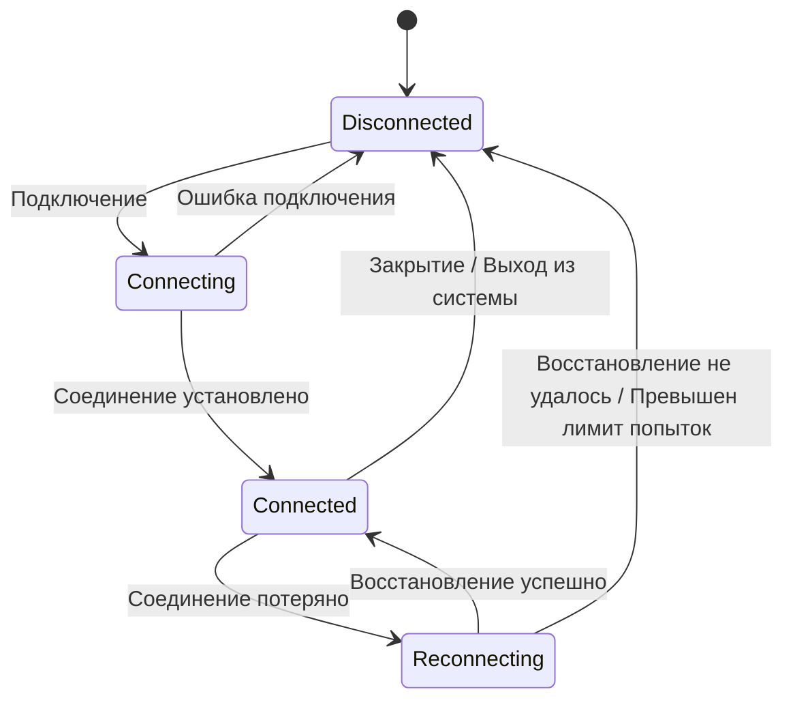

# Yandex Messenger Native — Архитектура

## Обзор

Нативный Linux-клиент для Яндекс Мессенджера, разработанный на Rust и GTK4.
Приложение построено на основе слоистой архитектуры с четким разделением между интерфейсом (UI), бизнес-логикой и сетевым взаимодействием (API).

```mermaid
flowchart TD
    %% Styling
    classDef user fill:#e1f5fe,stroke:#01579b,stroke-width:2px;
    classDef ui fill:#e8f5e9,stroke:#2e7d32,stroke-width:2px;
    classDef core fill:#fff8e1,stroke:#f57f17,stroke-width:2px;
    classDef api fill:#f3e5f5,stroke:#6a1b9a,stroke-width:2px;
    classDef ext fill:#ffebee,stroke:#c62828,stroke-width:2px;

    subgraph UserGroup ["Пространство пользователя"]
        User["Пользователь (Desktop)"]:::user
    end

    subgraph UILayer ["Слой UI (src/ui/*)"]
        direction LR
        AuthDialog["AuthDialog"]
        ChatListPanel["ChatListPanel"]
        ChatView["ChatView"]
        TelemostWindow["TelemostWindow"]
        TrayHandle["TrayHandle"]
        Notifications["Notifications"]
        Settings["Settings"]
        Theme["Тема (CSS)"]
    end
    class UILayer ui;

    subgraph CoreLayer ["Слой Core (src/core.rs)"]
        AppController["AppController"]
        AppState["AppState (Arc&lt;Mutex&gt;)"]
        AppEvent["AppEvent (enum)"]
    end
    class CoreLayer core;

    subgraph APILayer ["Слой API (src/api/*)"]
        direction LR
        AuthManager["AuthManager (OAuth2)"]
        HttpClient["HttpClient (reqwest)"]
        WebSocketClient["WebSocketClient"]
    end
    class APILayer api;

    subgraph External ["Внешние сервисы"]
        OAuth["OAuth эндпоинты"]
        MessengerAPI["Messenger API (REST)"]
        UniproxyWS["Uniproxy WS"]
        Disk["Файлы (Yandex Files)"]
    end
    class External ext;

    %% Connections
    User -->|"GTK4 События / Системные вызовы"| UILayer
    UILayer -->|"Коллбеки / Shared State"| CoreLayer
    CoreLayer -->|"Асинхронные вызовы API"| APILayer
    APILayer -->|"HTTP / WS / Диск"| External
```



## Описание слоев

### Слой UI

Слой UI состоит из изолированных виджетов GTK4, каждый из которых управляет собственным рендерингом и взаимодействием с пользователем. Виджеты общаются со слоем Core через замыкания (коллбеки) и разделяемое состояние.

- **AuthDialog** (`auth_dialog.rs`): Диалог входа OAuth. Поддерживает открытие внешнего браузера и встроенный WebView (feature `in_app_webview`). Извлекает токен из фрагмента URL.
- **ChatListPanel** (`chat_list.rs`): Боковая панель со списком чатов, отображающая название, аватар, превью последнего сообщения, счетчик непрочитанных и статус закрепления чата. Генерирует сигнал `chat_selected`.
- **ChatView** (`chat_view.rs`): Главная область сообщений с виртуализированным MessageList, полем ввода MessageInput (текст + вложения) и кнопкой звонка. Обрабатывает отправку, ответы, пересылку и реакции.
- **TelemostWindow** (`telemost.rs`): Окно-обертка для видеозвонков Яндекс Телемост. Поддерживает отключение звука/видео и завершение звонка.
- **TrayHandle** (`tray.rs`): Иконка системного трея с контекстным меню (открыть, настройки, выход).
- **Notifications** (`notifications.rs`): Системные уведомления на рабочем столе с использованием библиотеки `notify-rust`.
- **Settings** (`settings.rs`): Сохраняемые настройки в формате JSON (темная тема, сворачивание в трей). Файл расположен по пути `~/.config/yandex-messenger-native/settings.json`.
- **Тема** (`theme.css`): Глобальные CSS-стили для GTK. Поддержка темного режима осуществляется через параметр `gtk::Settings::gtk_application_prefer_dark_theme`.

### Слой Core

Класс `AppController` (`src/core.rs`) является центральным оркестратором приложения. Он владеет:

- `AuthManager` — жизненный цикл токенов OAuth
- `HttpClient` — REST API-клиент
- `WebSocketClient` — WebSocket-клиент реального времени
- `AppState` — общее изменяемое состояние приложения (Shared mutable state)

Структура `AppState` содержит:
```rust
pub struct AppState {
    pub chats: Vec<Chat>,                    // Кэшированный список чатов
    pub selected_chat_id: Option<String>,    // Идентификатор активного чата
    pub messages_by_chat: HashMap<String, Vec<Message>>, // История сообщений по чатам
}
```

Контроллер предоставляет асинхронные методы для выполнения всех операций. Код UI вызывает их через `tokio::Runtime::block_on` в главном потоке GTK.

### Слой API

#### AuthManager (`src/api/auth.rs`)
Обеспечивает полную поддержку OAuth2 Authorization Code Flow:
1. Генерирует URL авторизации с параметрами `response_type=code`, `client_id`, `state`, `device_id`.
2. Пользователь авторизуется в браузере и перенаправляется на страницу с `#access_token=...`.
3. Токен парсится из фрагмента URL и сохраняется в `~/.config/yandex-messenger-native/token.json`.
4. При запуске загружает токен с диска и проверяет его валидность (с буфером в 300 секунд).
5. При истечении срока действия использует `refresh_token` для получения нового токена.
6. Поддерживает режим auth-proxy для централизованной авторизации.

Токены хранятся с использованием блокировки файлов (через `fs::write`) в формате JSON, содержащем:
- `access_token`, `refresh_token`, `expires_in`, `token_type`, `user_id`.

#### HttpClient (`src/api/mod.rs`)
REST-клиент на базе библиотеки `reqwest` с поддержкой `rustls-tls`:
- **Авторизация**: Заголовок `Authorization: OAuth <token>` добавляется ко всем запросам.
- **CSRF**: Запрашивает CSRF-токен с пути `/csrf-token/` перед выполнением мутирующих запросов.
- **Список чатов**: `GET /api/get_chat_list?offset=&limit=`
- **История**: `GET /api/get_history?chatId=&offset=&limit=`
- **Отправка сообщения**: `POST /api/send_text` с JSON-телом.
- **Загрузка**: `PUT /media_upload/<chatId>/<filename>?<uuid>` на сервера Yandex Files.
- **Скачивание**: `GET /file_shortterm/<fileId>` из Yandex Files.
- **Профиль пользователя**: `GET /api/get_profile`
- **Ссылка Телемост**: Создает URL вида `https://telemost.yandex.ru/?chatId=<id>`

Парсинг ответов поддерживает как плоские списки, так и обернутые ответы (`ListResponse<T>` с полями `items`/`chats`/`messages`).

#### WebSocketClient (`src/api/mod.rs`)
WebSocket-клиент для работы с Yandex Uniproxy (`wss://uniproxy.messenger.yandex.ru/uni.ws`):
- **Счетчик последовательности (Sequence)**: Каждое исходящее сообщение получает инкрементируемый `seq`.
- **Формат сообщений**: `{"seq": N, "message": {"method": "...", "params": {...}}}`
- **Методы**: `subscribe`, `unsubscribe`, `bootstrap`.
- **Коллбеки**: `on_message()` для входящих сообщений, `on_state_change()` для событий состояния подключения (Disconnected → Connecting → Connected → Reconnecting).
- **Текущий статус**: Базовый каркас подключения и отправки (разработка полного транспортного цикла находится в процессе).

### Модели данных (`src/models/mod.rs`)
Доменные типы данных с поддержкой сериализации `serde`:
- **Chat**: id, название, тип чата (Private/Group/Channel/Bot), участники, счетчик непрочитанных, последнее сообщение, флаги закрепления/архивации/выключения звука.
- **Message**: id, ID чата, ID отправителя, тип, текст, разметка (entities), ответ на сообщение (reply_to), пересланное сообщение (forward), медиафайлы, реакции, статус доставки и прочтения.
- **User**: id, телефон, email, имя, никнейм (username), ID аватара, статус в сети, флаги бота и премиума.
- **WSMessage/WSResponse**: Конверты протокола WebSocket с seq, result и error.
- **MediaAttachment**: Метаданные файлов с миниатюрами, разрешением, размером и длительностью.
- **TelemostCall**: Жизненный цикл звонка с участниками и статусами.

---

## Диаграммы потоков данных

### Процесс WebSocket/HTTP взаимодействия (Interaction Flow)



### Выбор чата (Chat Selection Flow)
```
Пользователь выбирает чат в ChatListPanel
        │
        ▼
ChatListPanel генерирует сигнал chat_selected
        │
        ▼
Коллбек в main.rs: controller.select_chat(chat_id)
        │
        ├──▶ WebSocketClient.subscribe(chat_id)
        │        │
        │        ▼
        │   Отправка WS {"method":"subscribe","params":{"chatId":"..."}}
        │        │
        │        ▼
        │   Ожидание входящих сообщений WS (в процессе)
        │
        └──▶ HttpClient.get_messages(chat_id, limit=50)
                 │
                 ▼
            GET /api/get_history?chatId=...&offset=0&limit=50
                 │
                 ▼
            Парсинг ответа → Vec<Message>
                 │
                 ▼
            Обновление AppState.messages_by_chat[chat_id]
                 │
                 ▼
            ChatView.set_messages(messages)
                 │
                 ▼
            Рендеринг списка сообщений в интерфейсе
```

### Отправка сообщения (Message Send Flow)
```
Пользователь вводит текст и нажимает отправить
        │
        ▼
ChatView генерирует событие send_message(chat_id, text)
        │
        ▼
Коллбек в main.rs: controller.send_text_message(chat_id, text)
        │
        ▼
HttpClient.send_message(chat_id, text)
        │
        ▼
POST /api/send_text {"chatId":"...","text":"..."}
        │
        ▼
Парсинг ответа → Message
        │
        ▼
Обновление AppState.messages_by_chat[chat_id].push(message)
        │
        ▼
ChatView.append_message(message)
        │
        ▼
Отображение нового сообщения внизу списка
        │
        ▼
Отправка системного уведомления на рабочий стол
```

### Авторизация OAuth (OAuth Flow)
```
Запуск приложения
    │
    ▼
AuthManager.load_token()
    │
    ├── Токен существует И не истек ──▶ Переход к главному окну
    │
    └── Токен отсутствует ИЛИ истек
            │
            ▼
    AuthDialog.show()
            │
            ▼
    Открытие браузера → Страница авторизации Yandex OAuth
            │
            ▼
    Пользователь вводит учетные данные и подтверждает вход
            │
            ▼
    Перенаправление на redirect_uri с #access_token=...
            │
            ▼
    AuthDialog.parse_token_from_url()
            │
            ▼
    AuthManager.save_token(token)
            │
            ▼
    AppController.new(auth, token)
            │
            ▼
    AppController.connect_realtime()
            │
            ▼
    WebSocketClient.connect() → WSState.Connected
            │
            ▼
    AppController.load_chats()
            │
            ▼
    Отрисовка главного окна интерфейса
```

### Обновление токена (Token Refresh Flow)
```
Срок действия AccessToken истекает (expires_in <= 300)
    │
    ▼
AuthManager.refresh_token(refresh_token)
    │
    ▼
POST /token {grant_type: "refresh_token", client_id, refresh_token}
    │
    ├── Успешно ──▶ Новый токен сохраняется на диск
    │                  │
    │                  ▼
    │             Обновление AppState в памяти
    │
    └── Ошибка ──▶ Повторное отображение AuthDialog
                     │
                     ▼
                  Пользователь проходит авторизацию заново
```

### Загрузка файлов (File Upload Flow)
```
Пользователь прикрепляет файл в ChatView
    │
    ▼
ChatView генерирует событие upload_file(chat_id, bytes, filename)
    │
    ▼
AppController.upload_file(chat_id, bytes, filename)
    │
    ▼
HttpClient.upload_file()
    │
    ▼
PUT https://files.messenger.yandex.net/media_upload/<chatId>/<filename>?<uuid>
    Заголовки: Authorization: OAuth <token>
    Тело: байты файла
    │
    ▼
Парсинг ответа → fileId
    │
    ▼
Отправка сообщения со ссылкой на файл через send_message()
    │
    ▼
Системное уведомление: "Файл успешно загружен"
```

---

## Управление состоянием (State Management)

В приложении используется паттерн единого разделяемого состояния (Single Shared State):

```
AppController (владеет)
    └── Arc<Mutex<AppState>>
            ├── chats: Vec<Chat>
            ├── selected_chat_id: Option<String>
            └── messages_by_chat: HashMap<String, Vec<Message>>
```

Компоненты UI получают клонированные ссылки `Arc<Mutex<AppState>>` и блокируют их для чтения при отрисовке. Изменения состояния происходят внутри асинхронных методов `AppController`, после чего UI обновляется с помощью коллбеков, зарегистрированных в `main.rs`.

Этот подход позволяет обойтись без сложных библиотек управления состоянием и обеспечивает потокобезопасный доступ благодаря `Mutex` из библиотеки Tokio.

---

## WebSocket-протокол

Клиент общается с Uniproxy Яндекса по следующему протоколу:

### Формат исходящих сообщений
```json
{
  "seq": 0,
  "message": {
    "method": "subscribe",
    "params": {"chatId": "chat-uuid"}
  }
}
```

### Поддерживаемые методы
- `subscribe` — подписка на обновления чата.
- `unsubscribe` — отписка от обновлений чата.
- `bootstrap` — запрос начального состояния приложения.

### Формат входящих сообщений
```json
{
  "seq": 0,
  "result": {...},
  "error": null
}
```

Либо в виде событий от сервера:
```json
{
  "seq": 0,
  "message": {
    "method": "message",
    "params": {"chatId": "...", "message": {...}}
  }
}
```

### Состояния подключения



---

## Константы конфигурации (`src/config.rs`)

| Константа | Значение | Описание |
|---|---|---|
| `OAUTH_CLIENT_ID` | `<YOUR_YANDEX_CLIENT_ID>` | OAuth Client ID приложения |
| `API_BASE_URL` | `https://yandex.ru/messenger/api/registry/api/` | Базовый REST API |
| `UNIPROXY_URL` | `wss://uniproxy.messenger.yandex.ru/uni.ws` | Точка подключения WebSocket |
| `FILE_PUBLIC_HOST` | `https://files.messenger.yandex.net` | Сервис работы с файлами |
| `TELEMOST_URL` | `https://telemost.yandex.ru` | Видеозвонки Телемост |
| `MAX_MESSAGE_LENGTH` | 4096 | Максимальная длина сообщения |
| `MAX_FILE_SIZE` | 50MB | Максимальный размер загрузки |
| `HISTORY_CHUNK_SIZE` | 50 | Сообщений на страницу истории |
| `WS_HEARTBEAT_INTERVAL` | 30s | Интервал пинга WebSocket |
| `MAX_MEMBERS_COUNT` | 1000 | Лимит участников группы |
